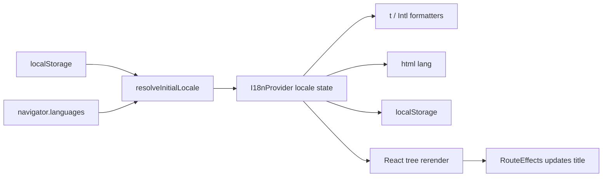

# Homepage Prototype 国际化设计

**日期：** 2026-07-15  
**范围：** `docs/web/homepage-prototype` 及其全部现有路由  
**支持语言：** 简体中文（`zh-CN`）、英语（`en`）、日语（`ja`）

## 1. 目标与验收范围

为首页、工作台、新建创作、项目列表、项目结果、短剧解说设置、AI 分析、旁白编辑器和 404 页面提供即时语言切换。切换不刷新页面、不改变 URL，并保留当前路由与 React 交互状态。

翻译覆盖：

- 标题、正文、导航、按钮、标签、占位符、选项、状态、步骤、筛选、分页与操作菜单。
- Toast、错误信息、确认信息和“建设中”提示。
- `aria-label`、图片替代文本、隐藏标题及页面 `document.title`。
- 官网桌面与移动端、工作台桌面与移动端、独立旁白编辑器顶部栏。

明确不翻译：

- 用户或示例项目名，例如“霸总短剧解说 01”。
- 上传文件名、字幕文件名与音乐文件名。
- 媒体中的原始字幕，以及视频翻译案例展示的源内容与目标内容。
- 品牌名、时间码、分辨率、格式、数值 ID 等内容或技术值。

## 2. 架构

采用无第三方国际化运行时的轻量 React 实现：

```text
src/i18n/
├── locale.js             # 语言规范化、检测、资源查找和 Intl 纯函数
├── I18nProvider.jsx      # locale 状态、持久化、html lang、翻译和格式化 API
├── useI18n.js            # Context 消费入口
└── locales/
    ├── zh-CN.js
    ├── en.js
    └── ja.js

src/components/i18n/
└── LanguageSwitcher.jsx  # 三端共用的菜单交互
```

公共接口：

```js
const {
  locale,                         // "zh-CN" | "en" | "ja"
  setLocale,                      // (locale) => void
  t,                              // (key, params?) => string
  formatNumber,                   // (value, options?) => string
  formatDate,                     // (value, options?) => string
} = useI18n();
```

`main.jsx` 在 `BrowserRouter` 外或内均可挂载 `I18nProvider`，但 Provider 必须包住 `App`。资源静态打包，不引入异步请求和加载闪烁。翻译键按领域分组：`common`、`home`、`dashboard`、`create`、`projects`、`projectResult`、`narration`、`analysis`、`editor`、`errors`、`titles`。

## 3. 语言解析与数据流

初始化优先级严格为：

```text
localStorage("narrato.locale")
→ navigator.languages（按数组顺序寻找首个支持语言）
→ zh-CN
```

规范化规则：`zh-CN`、`zh-Hans`、`zh-SG` 与小写变体映射到 `zh-CN`；`en-*` 映射到 `en`；`ja-*` 映射到 `ja`；其他值不受支持。无效或无法读取的持久化值被忽略，继续浏览器语言检测。



用户切换语言时，`setLocale` 只接受规范化后的支持语言；随后同步 React 状态，并由 effect 写入 `localStorage` 与 `document.documentElement.lang`。当前 URL、历史栈、滚动目标和业务状态不因语言切换发生变化。`RouteEffects` 同时依赖 `pathname` 和 `locale`，因此当前页面标题会立即更新；仅路由改变时执行滚动和标题聚焦，避免语言切换把页面滚回顶部或抢走焦点。

## 4. 翻译查找、插值与失败回退

`t(key, params)` 使用点号路径读取当前语言资源，并支持 `{name}` 形式的简单字符串插值。失败策略必须确定且可测试：

1. 当前语言存在字符串：返回插值后的字符串。
2. 当前语言缺键：读取同键的 `zh-CN` 文案。
3. 中文资源仍缺键：开发环境输出一次 `console.warn`，界面返回翻译键本身，禁止返回空字符串或让组件崩溃。
4. 插值参数缺失：保留原占位符，以便测试和视觉检查发现资源错误。
5. `localStorage` 读写因隐私模式或浏览器策略抛错：继续使用内存状态，不阻断渲染或切换。
6. `Intl` 输入无效：调用方保留原始内容值；技术值不得为了本地化而改写业务数据。

`Intl.NumberFormat(locale)` 用于余额、用量、计数等界面数值。日期仅在数据语义为日期时由 `Intl.DateTimeFormat` 格式化；时间码、媒体时长和日志时刻继续按原值显示。

## 5. 内容数据边界

`src/data/*.js` 不复制为三套完整业务数据。稳定 ID、路由、数值、图标、媒体地址、项目名和文件名继续是语言无关数据；界面名称、说明、状态、步骤与提示改为翻译键，例如 `labelKey`、`descriptionKey`、`statusKey`、`unavailableMessageKey`。组件在渲染时调用 `t()`。

筛选与状态判断只使用 `id`、`type`、`status` 等稳定字段，禁止依赖翻译后的标签。项目搜索继续匹配项目原名；翻译键只改变界面，不改变搜索语义。翻译案例中用于说明翻译结果的内容文本属于演示内容，作为原始数据保留。

## 6. LanguageSwitcher 交互

公共切换器接收 `compact`、`placement`、`className` 等纯展示参数，但语言列表与行为统一：

- 桌面官网：位于登录按钮左侧，触发器显示地球图标及 `简中` / `EN` / `日本語`。
- 官网移动菜单：在登录按钮上方直接显示三项语言。
- `DashboardHeader`：位于创作点区域左侧；窄屏采用紧凑地球图标按钮。
- 旁白编辑器：置于独立 `editor-topbar` 的创作点区域之前，不改变编辑器主体结构。

菜单项始终使用自称名称“简体中文 / English / 日本語”。触发器具有 `aria-haspopup="menu"` 与 `aria-expanded`；菜单使用 `role="menu"`，选中项使用 `aria-current="true"` 和可见勾选标记。支持点击打开、点击外部关闭、`Escape` 关闭并恢复焦点、上下方向键循环移动、`Home`/`End` 跳转以及 `Enter`/空格选择。切换后关闭菜单且焦点回到触发器。

英文和日文长度通过 Flex/Grid 自然伸缩；菜单不得被 header 裁切，按钮与卡片不得以省略号掩盖关键操作文案。

## 7. 页面与编辑器边界

所有含中文 UI 字符串的页面、组件和相关数据文件纳入迁移。`BrandMark` 中品牌名保持不变；其可访问文本如存在描述性短语则翻译。媒体文件、图片和海报继续作为合法内容资产，不新增截图、base64、canvas 或背景贴图来适配多语言。

旁白编辑器改动仅限文案、切换器和布局容纳：

- 不修改 `editor-reducer.js` 的时间、选中、播放与轨道业务行为。
- 不修改 `timeline-geometry.js` 的 `x = time × pixelsPerSecond` 坐标模型。
- 不改变媒体源、`loadedmetadata.duration`、拖拽、缩放、滚动、seek、波形实例生命周期或轨道数据。
- 字幕 cue 的 `text`、项目名、文件名继续显示原文；围绕它们的标签和操作按钮翻译。
- 语言切换不得重挂载播放器、时间轴、波形或清空编辑中的 textarea 状态。

## 8. 测试策略

项目当前没有单元测试框架。使用 Node 内置 `node:test` 对 `locale.js` 纯函数做 TDD，不增加测试依赖；使用现有 Playwright 脚本风格新增 `scripts/verify-i18n.mjs` 做真实路由和交互验证。

纯函数测试覆盖：

- 三种语言及地区变体规范化。
- 持久化值优先于浏览器语言。
- `navigator.languages` 顺序匹配与不支持语言回退 `zh-CN`。
- 当前语言缺键时回退中文、中文也缺键时返回 key。
- 插值与 `Intl` 格式化。

Playwright 验证覆盖：

- 每个现有路由在 `zh-CN`、`en`、`ja` 下可访问且 `<html lang>`、标题和关键标题正确。
- 手动切换即时生效，URL 不变，刷新后语言持久化。
- 官网桌面、官网移动菜单、DashboardHeader、编辑器顶部栏均有入口。
- 菜单键盘操作、外部点击、`Escape`、焦点恢复和当前项状态。
- 英文与日文在 1487px、768px、390px 视口无页面级横向溢出、菜单裁切或关键操作遮挡。
- 编辑器切换语言前后媒体元素与编辑输入状态保持，时间线缩放和拖拽验证脚本继续通过。
- 构建产物中不引入参考图、`data:image` 或截图贴图。

## 9. 验收标准

1. `zh-CN`、`en`、`ja` 可在所有现有路由即时切换，刷新后保持选择。
2. 初始化优先级为 `localStorage > navigator.languages > zh-CN`，不支持语言稳定回退中文。
3. 切换语言不改变 URL、不刷新页面、不丢失当前交互状态。
4. 页面标题、`html[lang]`、可见 UI、Toast、错误提示和无障碍文案全部随语言更新。
5. 项目名、文件名、媒体原始字幕和翻译案例内容保持原文。
6. 桌面官网、移动菜单、工作台 header 和旁白编辑器顶部栏均提供可键盘操作的切换入口。
7. 三种语言在桌面和移动视口无明显溢出、遮挡或不可读截断。
8. 既有路由、构建与页面验证通过；编辑器时间、媒体、拖拽、缩放、滚动与波形行为无回归。
9. 隐藏或删除全部参考图后，页面主体内容仍完整；实现中无截图贴图、base64、canvas 截图绘制或 SVG 内嵌位图。

