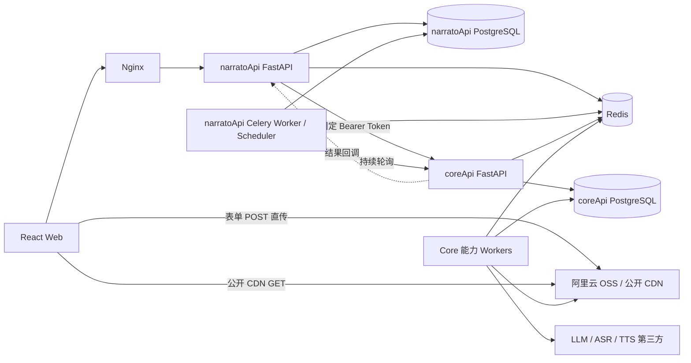

# NarratoAI 多用户 API 平台正式架构设计

> 文档日期：2026-07-16
> 适用版本：第一版短剧解说业务
> 文档状态：需求已确认，可进入实施
## 1. 背景与目标
当前仓库已经具备视频分析、文案生成、ASR、TTS、字幕处理、视频渲染和剪映草稿等 Python 能力，Web 原型则定义了上传、分析、编辑、渲染和结果导出的用户流程。

本设计将系统拆成两个独立 FastAPI 项目：

- `narratoApi`：面向 Web 和多用户业务，负责鉴权、项目、积分、上传、编排和任务查询。
- `coreApi`：把现有 NarratoAI Python 能力封装成第三方原子能力 API，不承担用户业务流程。

第一版目标是打通可部署、可恢复、可计费的短剧解说完整链路，并为视频翻译和短剧混剪保留清晰扩展边界。

设计原则如下：

- 业务数据库和能力数据库彻底隔离，只通过 HTTP 与公开 CDN URL 交换数据；耗时工作全部异步执行；控制类操作同步返回；长流程由持久化 DAG 编排，系统可从失败节点自动重试；对外 API 只使用 `GET` 和 `POST`；采用必要的应用服务、适配器和状态机，不建设通用工作流平台或复杂类层级；所有公开接口、类、方法和函数使用简洁中文 Docstring，关键业务分支补充中文行内注释。
## 2. 范围与非范围
### 2.1 第一版范围
- 个人用户邮箱验证码注册、邮箱密码登录和找回密码；单点登录 Token 校验；阿里云 OSS 表单直传、上传确认和异步媒体校验；短剧解说项目创建、费用预估、扣费、分析、人工编辑、最终渲染和导出；Core 能力目录同步，以及统一的模型、音色等稳定 ID；PostgreSQL 持久化任务状态，Redis + Celery 执行异步任务；Core 回调与 `narratoApi` 持续轮询双通道状态同步；SSE 任务事件推送和 GET 低频校准；最终视频、字幕、配音、文案时间轴等已登记产物下载；桌面 Chrome/Edge 前端流式生成剪映草稿 ZIP；Supervisor 宿主机进程部署、JSON 日志、健康检查和限流。
### 2.2 第一版非范围
- 不支持团队、组织、成员、角色或租户体系；不建设管理后台；未来管理系统使用独立账号和独立项目；不接支付宝、微信等在线支付；不实现节点级计费，短剧解说统一按总时长计费；不提供用户取消、用户手动重试或失败任务恢复入口；不跨项目复用失败任务的成功节点或中间产物；不支持任务完成后的再次编辑或再次渲染；不使用 Docker、Kubernetes、GPU 或通用低代码工作流编辑器；不实现 OSS 分片上传、断点续传和私有签名下载；不由服务端生成或保存剪映 ZIP。
## 3. 关键决策覆盖表

| 主题 | 已确认决策 | 第一版落地方式 |
| --- | --- | --- |
| 技术栈 | 两层均为 FastAPI | 独立虚拟环境、独立进程 |
| 服务边界 | 业务与能力分离 | `narratoApi` 编排，`coreApi` 执行原子能力 |
| 数据库 | 完全隔离 | 两个 PostgreSQL Database 和账号 |
| HTTP 方法 | 只用 GET/POST | 更新、删除用语义化 POST 动作接口 |
| 异步 | 所有耗时任务异步 | Celery Worker + PostgreSQL 状态 |
| 失败恢复 | 系统从失败节点续跑 | attempt、租约、心跳、指数退避 |
| 状态同步 | 回调和轮询并行 | 同一幂等结果处理器收口 |
| 上传 | OSS 表单 POST 直传 | 参考 `docs/web/docs/Oss.php` |
| CDN | 公开 URL | 数据库保存 object key 与 CDN URL |
| 用户 | 仅个人账户 | 所有资源直接关联 `user_id` |
| Token | Redis 单点登录 | 随机 Token、哈希存储、默认 30 天 |
| 计费 | 产品级时长计费 | 默认每开始一分钟 20 点 |
| 删除 | 仅终态项目可删除 | 仅 `completed`、`failed` 可发起 |
| 编辑等待 | 永久等待 | `waiting_for_edit` 不超时、不退款 |
| 导出 | 失败任务不可导出 | 仅 `completed` 项目开放导出 |
| 剪映 | 前端流式生成 ZIP | ZIP 不上传、不入库 |
| 部署 | 宿主机进程 | Supervisor + Nginx |

## 4. 总体架构



PostgreSQL 是业务状态的唯一事实来源。Redis 只承担 Celery Broker、Token、验证码、限流、缓存和短期分布式锁，不作为任务最终结果存储。
## 5. 服务边界和目录

```text
docs/api/narratoApi/             # 多用户业务层独立 FastAPI 项目
├── narrato_api/api/             # Web、内部回调和服务接口
├── narrato_api/application/     # 用例、编排、计费和状态迁移
├── narrato_api/domain/          # 少量领域实体与枚举
├── narrato_api/infrastructure/  # PostgreSQL、Redis、OSS、Core 客户端
├── narrato_api/workflows/       # 版本化工作流模板
├── tests/
├── pyproject.toml
└── config.example.toml

coreApi/                         # 底层能力独立 FastAPI 项目
├── core_api/api/                # 原子能力路由
├── core_api/application/        # 能力任务用例
├── core_api/adapters/narrato/   # 对现有 app/services 的适配
├── core_api/providers/          # LLM、ASR、TTS 统一供应商适配
├── core_api/infrastructure/     # DB、Redis、OSS、回调客户端
├── tests/
├── pyproject.toml
└── config.example.toml

app/                             # 现有 NarratoAI Python 能力，逐步去除 WebUI 耦合
```

边界约束：

- `narratoApi` 不导入现有视频处理代码，不执行 FFmpeg、ASR、TTS 或渲染；`coreApi` 不读取 `narratoApi` 数据库，不理解用户积分和页面流程；两层只共享版本化 OpenAPI 契约或生成的 DTO，不共享业务实现；路由层只负责校验和响应；核心逻辑进入应用服务；供应商差异只存在于 Core Provider Adapter 内部；不为每张表机械创建抽象基类；只对数据库会话、任务公共字段和供应商协议做薄封装。
## 6. 统一协议：GET、POST、响应、错误、幂等和 ID
所有自有接口只允许 `GET` 与 `POST`：

- `GET` 只查询，不产生业务状态变更；`POST` 用于创建、保存、删除请求、同步、回调等动作；异步任务创建成功返回 HTTP `202`；普通同步成功返回 HTTP `200`，资源创建可返回 HTTP `201`。

统一响应结构：

```json
{
  "code": "TASK_CREATED",
  "message": "任务已创建",
  "data": {},
  "request_id": "req_01J..."
}
```

错误码必须是稳定英文枚举，前端不得根据 `message` 分支。主要 HTTP 状态：

- `400/422`：请求或字段校验错误；`401`：Token 错误、过期或已被新登录替换；`403`：资源不属于当前用户或当前状态禁止操作；`404`：资源不存在；`409`：幂等冲突、状态冲突、价格变化或余额不足；`429`：频率、用户并发或队列保护限制；`500/503`：内部异常或依赖暂时不可用。

关键 POST 必须携带 `X-Idempotency-Key`，包括创建项目流程、上传确认、开始任务、提交渲染、扣费/退款、Core 原子任务创建和结果回调。

幂等键作用域为“调用方 + 路径 + Key”。相同 Key 和相同请求返回第一次结果；请求体摘要不同则返回 `409 IDEMPOTENCY_CONFLICT`。

业务 ID 使用带资源前缀的 UUIDv7/ULID，例如 `prj_`、`job_`、`node_`、`ctask_`、`art_`。ID 对调用方不可解析；文件名 MD5 规则与业务 ID 分离。
## 7. 鉴权和用户
第一版仅支持个人用户：

- 邮箱验证码注册，验证码默认 10 分钟有效并存 Redis；SMTP 邮件在 Web 请求内同步发送，发送失败则请求失败；支持邮箱密码登录和邮箱验证码找回密码；密码使用 Argon2id 或 bcrypt 哈希，禁止明文或可逆加密；新用户注册成功默认赠送 100 创作点，该数值可配置。

登录 Token 规则：

- 登录生成高强度随机 Token，前端缓存原始值；Redis 只保存 Token 哈希、`user_id` 和必要会话元数据，默认 TTL 为 30 天；每个用户只允许一个有效 Token；新登录通过 Redis 原子操作替换旧 Token；Token 固定过期，不做滑动续期，不提供 Refresh Token；退出登录、修改密码或禁用用户时立即删除 Token；校验失败统一返回 HTTP `401`，前端清除缓存并提示重新登录。

`narratoApi` 调用 Core 和 Core 回调第一版使用两个独立固定 Bearer Token，并通过 HTTPS 传输；鉴权集中在 FastAPI Dependency，后续可以替换为 OAuth2 Client Credentials。
## 8. OSS 上传校验、CDN 和命名
对象键固定规则：

```text
narrato/api/YYYY/MM/DD/<random-md5>.<ext>
narrato/coreApi/YYYY/MM/DD/<random-md5>.<ext>
```

`random-md5` 默认由 `MD5(UUIDv7 + owner_id/task_id + timestamp + random_nonce)` 生成，不计算大文件内容 MD5；扩展名必须来自白名单。

上传约束默认值均可在产品配置中调整：

- 视频格式：`.mp4`、`.mov`、`.avi`；视频单文件最大 300 MiB，即 314,572,800 字节；字幕格式：`.srt`，单文件最大 5 MiB；短剧解说最多 5 个视频，每个视频最长 10 分钟；未登录用户只能选择本地文件，登录后才能申请上传策略。

上传链路：

1. Web 向 `narratoApi` 申请签名表单，签名实现参考 `docs/web/docs/Oss.php`。
2. `narratoApi` 限定对象前缀、扩展名、Content-Type 和 Content-Length。
3. 浏览器使用表单 `POST` 直接上传 OSS，不经过业务服务器。
4. 上传成功后前端立即调用上传确认接口。
5. `narratoApi` HEAD 校验对象存在、路径、声明大小和元数据。
6. 资产进入 `validating`，异步请求 Core 媒体探测。
7. Core 通过 FFprobe 直接读取受限 CDN 视频 URL 的有限元数据，校验容器、时长、分辨率和流；SRT 在上传确认阶段仅复核对象声明，实际字幕处理节点再读取并解析内容。
8. 验证成功转为 `ready`，失败转为 `invalid`；只有全部资产 `ready` 才能开始任务。

数据库同时保存 `bucket`、`object_key` 和公开 CDN URL。文件默认不自动过期；只有用户主动删除允许删除的终态项目或账号时，才异步删除关联对象并记录审计结果。
## 9. 能力目录
Core 数据库是能力配置唯一来源，保存供应商、模型、音色、语言、格式和限制条件；第三方密钥从 Core TOML 配置读取，数据库只保存 `secret_ref`。

Core 只下发已配置、已启用且当前可调用的能力。不同供应商必须映射到统一 DTO，禁止让火山云、阿里云等原始字段泄漏到业务层。

统一 TTS 音色示例：

```json
{
  "voice_id": "voice_01J...",
  "provider_code": "volcengine",
  "name": "温柔女声",
  "languages": ["zh-CN"],
  "gender": "female",
  "styles": ["gentle"],
  "sample_url": "https://cdn.example.com/sample.mp3",
  "supported_formats": ["mp3", "wav"],
  "supported_sample_rates": [24000, 48000]
}
```

Web 和 `narratoApi` 只提交稳定 `voice_id`、`model_id` 等 ID。Core 对 ID 做最终校验，能力停用返回统一 `CAPABILITY_UNAVAILABLE`。

`narratoApi` 定时拉取能力目录并入库形成只读镜像；内部受保护 POST 可手动触发同步。页面读取本地镜像，Core 临时不可用不影响展示。任务创建时保存能力 ID 与目录版本快照。
## 10. 项目和任务状态机
一个项目对应一个完整创作任务，内部媒体校验、分析和渲染 Job 只是执行单元。

项目主要状态：

```text
draft
  -> uploading
  -> validating
  -> ready
  -> queued
  -> analyzing
  -> waiting_for_edit
  -> render_queued
  -> rendering
  -> completed

任一系统节点自动重试耗尽 -> failed
completed / failed -> deleting -> deleted
```

约束：

- `waiting_for_edit` 永久等待，不设置期限、不自动失败、不退款；用户不能取消任务，系统不提供取消状态和取消接口；用户不能手动重试；`failed` 是不可恢复终态；用户需要重新制作时必须创建全新项目，且不得复用旧任务节点；只有明确为 `completed` 或 `failed` 的任务才能请求删除；草稿、上传、校验、排队、分析、等待编辑和渲染中的任务都不能删除；`completed` 和 `failed` 项目均锁定，不能继续编辑或渲染。

内部 Job 状态统一为 `queued`、`running`、`retry_wait`、`succeeded`、`failed`；Core Task 使用同一语义，避免跨服务翻译歧义。
## 11. DAG 节点、自动重试、心跳租约、回调和持续轮询
`narratoApi` 使用服务端预定义、版本化 DAG 模板。创建工作流时保存模板版本及节点快照，后续模板变更不影响运行中或历史任务。

每个节点保存：

- 节点类型、依赖、输入快照和预期输出；当前状态、当前 attempt、最大自动重试次数；Core Task ID、能力目录版本、产物引用；`lease_token`、`lease_expires_at` 和 `heartbeat_at`；规范化错误码、用户可见消息和内部错误摘要。

默认自动重试策略可配置：临时网络错误、限流和供应商短暂故障最多重试 3 次，采用指数退避并增加随机抖动；参数错误、损坏文件和不支持格式等确定性错误不自动重试。

Worker 领取节点时获得带版本的租约，执行期间定期更新心跳。调度器发现租约与心跳超时后，确认旧 attempt 不再有效，再创建新 attempt 从该节点恢复；已成功上游节点不重跑。

所有 Core 结果都必须带 `core_task_id`、`attempt_no` 和租约版本。过期 attempt 即使晚到也只能记录审计，不得覆盖新 attempt 的状态。

状态同步双通道同时运行：

- Core 在状态变化和终态时向 `narratoApi` 发送签名 Bearer 回调，提供低延迟更新；`narratoApi` 调度器持续轮询所有非终态 Core Task，直到确认终态；回调和轮询结果进入同一个事务型幂等处理器，以 `event_id` 和状态版本去重；产物登记、节点完成、下游投递和费用补偿只能提交一次。

数据库扫描器负责发现长时间未投递的 `queued/retry_wait` 节点并重新投递，业务正确性不依赖 Celery Result Backend。
## 12. 短剧解说完整流程
1. 用户登录后创建项目。
2. Web 为每个视频或字幕申请 OSS 表单并直传。
3. 每次上传完成立即确认，Core 异步探测媒体。
4. 所有视频与可选字幕验证为 `ready` 后，服务端计算总时长和费用。
5. 用户确认开始；`narratoApi` 在同一事务中校验余额、扣费、冻结价格快照并创建完整工作流。
6. 有有效 SRT 的视频直接引用字幕；缺少 SRT 的视频自动执行 ASR。
7. Core 按节点执行内容分析、镜头/剧情拆解和解说文案生成。
8. 分析完成后项目进入 `waiting_for_edit`，用户可以编辑文案和时间轴。
9. 用户点击最终生成，服务端保存不可变编辑快照并立即锁定编辑器。
10. Core 执行 TTS、字幕生成、音视频处理、最终合成和产物登记。
11. 所有必需节点成功后项目进入 `completed`，结果页开放导出。
12. 任一节点系统自动重试耗尽后项目进入 `failed`，全额退款且禁止导出。

一个项目最多包含 5 个视频，每个不超过 10 分钟，因此默认最大总时长为 50 分钟；不另设更低总时长限制。
## 13. 编辑和渲染锁定
编辑器内拖拽、裁剪和文本修改先在前端本地即时生效，停止操作后防抖调用保存接口。服务端采用 Last Write Wins，不做多标签页乐观冲突检测。

在 `waiting_for_edit` 中可以反复保存当前草稿。提交最终渲染时：

- 服务端在事务中复制草稿形成不可变 `revision_id`；工作流后续节点只引用该快照，不读取可变草稿；项目立即进入 `render_queued`，编辑接口从此返回 `409 PROJECT_LOCKED`；每个项目只能提交一次最终渲染；渲染成功或最终失败后都不允许再次编辑、再次渲染或重新执行。

保存接口不在鼠标移动、播放头更新或连续拖拽过程中触发，避免无意义请求和数据库写放大。
## 14. 计费和退款
短剧解说第一版统一计费公式：

```text
cost = ceil(全部已验证视频总秒数 / 60) * 20
```

`20 创作点/开始分钟` 是可配置默认值，价格记录带版本。多个视频先累加真实时长，再整体向上取整。

费用预估由 `narratoApi` 根据 Core 探测后的真实时长计算，前端只展示接口结果。正式创建任务时服务端再次计算；若价格版本或媒体数据变化，返回 `409 PRICE_CHANGED` 和最新金额，不扣费。

任务创建和扣费必须在一个数据库事务中完成：

- 余额不足返回 `409 INSUFFICIENT_CREDITS`，不创建工作流；自动重试和失败节点恢复不重复扣费；系统自动重试全部耗尽并最终确认 `failed` 后，执行一次全额退款；退款新增反向账本流水，不修改原扣费记录；用户没有取消入口，因此不存在用户取消退款分支；`waiting_for_edit` 永久等待且不退款；成功任务不退款；删除成功任务也不退款。

第一版不建设节点计费表、不做中途结算、不接在线支付。注册赠送默认 100 点，通过本地 CLI 可执行幂等充值。
## 15. 数据模型和关键表
### 15.1 narratoApi 数据库

| 表 | 关键职责 |
| --- | --- |
| `users` | 邮箱、密码哈希、用户状态；不存登录 Token |
| `credit_accounts` | 用户当前创作点余额和并发安全版本 |
| `credit_ledger` | 赠送、充值、扣费、失败退款的不可变流水 |
| `product_prices` | 产品价格版本，默认短剧解说 20 点/分钟 |
| `projects` | 用户项目、产品类型、状态、锁定和删除状态 |
| `assets` | OSS 对象、CDN URL、媒体类型、校验状态和探测数据 |
| `editor_drafts` | 当前可变编辑草稿，Last Write Wins |
| `editor_revisions` | 提交渲染时的不可变快照 |
| `workflow_templates` | 服务端版本化 DAG 模板 |
| `workflow_instances` | 项目对应的工作流与模板快照 |
| `workflow_nodes` | 节点依赖、状态、输入输出和当前租约 |
| `node_attempts` | 每次自动执行、心跳、错误和 Core Task 绑定 |
| `job_events` | SSE 业务事件和单调递增序号 |
| `artifacts` | 明确登记的可导出产物，不含临时文件和剪映 ZIP |
| `capability_mirrors` | Core 能力目录本地只读镜像 |
| `idempotency_records` | 关键 POST 请求摘要与首次响应 |
| `dispatch_outbox` | 数据库提交后可靠投递 Celery 的待发消息 |
| `deletion_jobs` | 终态项目和账号的异步 OSS 删除审计 |

### 15.2 coreApi 数据库

| 表 | 关键职责 |
| --- | --- |
| `core_providers` | 供应商代码、启用状态和 TOML `secret_ref` |
| `core_models` | 统一模型配置、语言、限制和稳定 ID |
| `core_voices` | 统一音色配置、示例、格式和稳定 ID |
| `core_tasks` | 原子任务类型、状态、输入快照和调用方任务 ID |
| `core_task_attempts` | Worker attempt、租约、心跳和错误 |
| `core_artifacts` | Core 中间与输出对象、类型和 CDN URL |
| `callback_outbox` | 等待回调的状态事件，保证可重试发送 |

所有金额使用整数创作点；所有时间使用 UTC 存储；JSON 扩展字段只存能力特有的约束，不代替核心可查询字段。
## 16. narratoApi 接口清单
### 16.1 认证和账户
- `POST /api/v1/auth/register-code/send`：同步发送注册验证码；`POST /api/v1/auth/register`：验证码注册并赠送默认创作点；`POST /api/v1/auth/login`：登录并替换旧 Token；`POST /api/v1/auth/logout`：删除当前 Redis Token；`POST /api/v1/auth/password-code/send`：同步发送找回密码验证码；`POST /api/v1/auth/password/reset`：重置密码并使 Token 失效；`GET /api/v1/users/me`：当前用户信息和创作点余额。
### 16.2 项目、上传和配置
- `POST /api/v1/projects`：创建短剧解说项目；`GET /api/v1/projects`：分页查询当前用户项目；`GET /api/v1/projects/{project_id}`：查询项目详情、状态和进度；`POST /api/v1/projects/{project_id}/delete`：仅终态项目发起异步删除；`POST /api/v1/projects/{project_id}/uploads/policy`：生成 OSS 表单策略；`POST /api/v1/projects/{project_id}/uploads/complete`：确认上传并启动校验；`GET /api/v1/assets/{asset_id}`：查询资产与媒体校验状态；`POST /api/v1/projects/{project_id}/assets/order`：保存视频顺序；`GET /api/v1/capabilities`：读取本地能力目录镜像；`GET /api/v1/products/short-drama-narration/config`：格式、数量、时长和价格配置。
### 16.3 费用、执行和编辑
- `POST /api/v1/projects/{project_id}/cost-estimate`：按真实总时长计算费用；`POST /api/v1/projects/{project_id}/start`：扣费并创建完整工作流；`GET /api/v1/projects/{project_id}/analysis`：读取分析与初始编辑数据；`GET /api/v1/projects/{project_id}/editor`：读取当前草稿；`POST /api/v1/projects/{project_id}/editor/save`：防抖覆盖保存草稿；`POST /api/v1/projects/{project_id}/render/submit`：创建快照、锁定并排队最终渲染；`GET /api/v1/projects/{project_id}/result`：仅完成项目读取结果和产物。
### 16.4 任务事件、产物和内部接口
- `GET /api/v1/jobs/{job_id}`：查询内部 Job 当前状态；`GET /api/v1/jobs/{job_id}/events`：认证 SSE 事件流；`GET /api/v1/artifacts/{artifact_id}`：读取可导出产物信息；`POST /api/v1/projects/{project_id}/exports/jianying-manifest`：同步返回剪映基础文件和资源清单；`POST /api/v1/internal/core/callbacks`：幂等接收 Core 状态回调；`POST /api/v1/internal/capabilities/sync`：受保护的手动能力同步；`GET /api/v1/health/live`：进程存活检查；`GET /api/v1/health/ready`：数据库、Redis 等就绪检查。

明确不提供 `/cancel`、用户 `/retry`、已完成项目再次渲染和失败项目导出接口。
## 17. Core 原子接口清单
### 17.1 异步原子能力创建
- `POST /api/v1/media-probe/tasks`：探测视频元数据或确认 SRT 声明；`POST /api/v1/asr/tasks`：音频语音识别；`POST /api/v1/video-analysis/tasks`：帧、镜头、剧情等分析；`POST /api/v1/script-generation/tasks`：生成解说文案和结构化时间轴；`POST /api/v1/tts/tasks`：根据稳定音色 ID 生成配音；`POST /api/v1/subtitle/tasks`：生成、校正或合并字幕；`POST /api/v1/video-render/tasks`：裁剪、合成和输出最终视频。
### 17.2 共用查询和控制
- `GET /api/v1/tasks/{core_task_id}`：统一返回状态、进度、错误和产物；`GET /api/v1/tasks/{core_task_id}/events`：供诊断或低延迟服务间查询；`GET /api/v1/capabilities`：返回已启用的统一能力目录与版本；`POST /api/v1/jianying/manifests/build`：轻量、无状态生成剪映基础 JSON 和资源映射；`GET /api/v1/health/live`：Core 存活检查；`GET /api/v1/health/ready`：Core DB、Redis、OSS 和必要配置检查。

Core 不提供用户取消接口。系统自动重试由调度与节点 attempt 管理，不向 Web 暴露手动重试。

所有异步创建响应统一返回 `core_task_id`；所有查询使用统一 `status`、`phase`、`progress`、`error`、`artifacts` 结构，不因供应商而变化。
## 18. 事件、SSE 和日志
`job_events` 使用每个 Job 单调递增的 `sequence`。事件至少包含：

- `event_id`、`sequence`、`event_type` 和时间；项目状态、Job 状态、当前节点和总体进度；面向用户的简洁消息、自动重试次数和预计下一动作；新增可导出产物摘要。

前端使用带 `Authorization` Header 的 `fetch()` 流式读取 SSE，不使用无法方便设置 Header 的原生 `EventSource`。断线重连携带 `Last-Event-ID`，服务端补发未消费事件；前端同时低频 GET 项目详情校准终态。

用户只能看到脱敏业务事件，不返回堆栈、服务器路径、第三方原始响应、Token 或密钥。

两套服务输出 JSON 结构化日志，自动携带 `request_id`、`user_id`、`project_id`、`job_id`、`node_id`、`core_task_id` 和 `attempt_no`。日志按日期和大小轮转，禁止输出密码、完整 Token、第三方密钥及未经脱敏的请求体。
## 19. 产物和剪映 Manifest 前端流式 ZIP
只有节点明确登记为 `exportable` 的产物进入 `artifacts`，例如：

- 最终 MP4；最终 SRT；合并配音音频；文案与时间轴 JSON；业务上明确开放的分析 JSON。

FFmpeg 临时分片、抽帧图片、缓存和调试文件不对用户展示。只有 `completed` 项目可以导出；`failed` 项目即使已有部分文件也不允许导出。

结果页固定至少提供两个动作：

- “导出视频”：读取已登记最终视频的公开 CDN URL。
- “导出到剪映草稿”：请求后端生成 Manifest，然后由前端组包。

剪映导出流程：

1. 用户在桌面 Chrome/Edge 点击“导出到剪映草稿”。
2. `narratoApi` 校验项目为 `completed`，调用 Core 轻量生成草稿基础 JSON 和资源清单。
3. 接口返回 `package_name`、内联文件、CDN 文件 URL、`zip_path`、大小和可选校验摘要。
4. 前端通过公开 CDN 并发流式读取视频、音频和字幕。
5. 前端严格按 `zip_path` 组装剪映目录。
6. 前端使用 File System Access API 和流式 ZIP 库直接写入本地文件。

剪映 ZIP 不上传 OSS、不进入 `artifacts`、不创建导出任务记录。CDN 必须允许 Web 来源跨域 GET/HEAD、Range，并暴露 `Content-Length` 等必要 Header。
## 20. 并发、限流和安全
- `narratoApi` 按用户限制同时运行的完整工作流数，超出时进入公平排队；Core 按 `analysis`、`llm`、`asr`、`tts`、`render` 拆分 Celery 队列和 Worker 并发；用户并发、系统队列保护阈值和能力超时均通过配置维护；队列达到硬保护阈值时返回 `429` 或 `503`，不无限积压；Nginx 对连接、请求速率和请求体做粗粒度限制；Redis 对登录、邮箱验证码、上传策略、任务创建和服务 Token 做细粒度限流；OSS 策略限制前缀、大小、扩展名和短有效期；上传确认防止伪造资产；所有数据库查询强制带 `user_id` 归属条件，禁止仅凭资源 ID 查询；Core 下载 URL 前校验协议、域名白名单和对象前缀，降低 SSRF 风险；TOML 真实密钥文件不提交 Git，权限默认 `0600`，由 Supervisor 指定路径；公开 CDN URL 知道即可访问，这是已接受的产品边界；删除对象是撤销访问的唯一机制。
## 21. Supervisor 部署
第一版直接在 Linux 宿主机部署，两个项目使用独立虚拟环境、配置文件、数据库账号和日志目录。

Supervisor 至少管理：

- `narrato-api-web`：Uvicorn/Gunicorn Web 进程，并同步发送验证码邮件；`narrato-api-worker`：业务编排和删除 Worker；`narrato-api-scheduler`：Celery Beat 或独立数据库扫描调度器；`core-api-web`：Core FastAPI Web 进程；`core-worker-analysis`、`core-worker-llm`、`core-worker-asr`、`core-worker-tts`、`core-worker-render`。

基础服务为 Nginx、PostgreSQL 和 Redis。两项目可以共用 PostgreSQL 实例和 Redis 实例，但必须使用不同 Database/账号和 Redis Key 前缀、Celery Queue 前缀。

Supervisor 配置要求自动重启、合理停止超时、独立 stdout/stderr 日志和环境变量最小化。发布时先迁移数据库，再滚动重启 Web、Scheduler 和 Worker；长任务 Worker 使用优雅停止，避免直接杀死 FFmpeg 子进程。
## 22. 测试、迁移和实施路线
### 22.1 自动化测试
- 单元测试：计费取整、状态机守卫、幂等、Token 单点替换、目录 DTO 转换；集成测试：两套 PostgreSQL、Redis、Celery、OSS 适配器和事务 Outbox；契约测试：`narratoApi` 与 Core 的请求、响应、错误码和版本兼容；状态恢复测试：回调丢失、轮询重复、Worker 崩溃、心跳超时、旧 attempt 晚到；端到端测试：小型本地视频 + Fake LLM/ASR/TTS 打通上传后链路、分析、编辑、渲染和失败退款；浏览器测试：Chrome/Edge 验证 SSE 重连、401 退出、OSS 直传和剪映流式 ZIP；真实供应商通过独立 Smoke Test 命令验证，不作为普通 CI 的必需条件。
### 22.2 分阶段实施
**阶段 0：契约和骨架**

- 建立两个 FastAPI 项目、统一响应、配置加载、数据库迁移和健康检查。
- 固化 OpenAPI DTO、错误码、ID、幂等和中文注释规范。

**阶段 1：账户、积分和上传**

- 完成邮箱注册登录、Redis 单点 Token、账本和 100 点注册赠送。
- 完成 OSS 表单策略、上传确认、媒体探测和资产状态。

**阶段 2：Core 原子能力**

- 把媒体探测、ASR、分析、文案、TTS、字幕和渲染接入适配层。
- 移除执行链对 Streamlit、全局变量和共享临时目录的依赖。
- 每个 Core Task 使用独立工作目录和独立 OSS 对象键。

**阶段 3：持久化编排和可靠性**

- 实现版本化 DAG、节点 attempt、租约心跳、自动重试和 Outbox。
- 实现 Core 回调与持续轮询、幂等状态收口和 SSE 事件。

**阶段 4：短剧解说闭环**

- 实现费用预估、一次扣费、分析、永久编辑等待、快照锁定和一次渲染。
- 实现成功产物、最终失败退款、终态删除和公开 CDN 下载。

**阶段 5：剪映、部署和验收**

- 实现统一剪映 Manifest 与 Chrome/Edge 流式 ZIP。
- 补齐 Supervisor、Nginx、日志轮转、限流、Fake E2E 和真实 Smoke Test。

现有 Streamlit/WebUI 继续可用，但新 API 不调用页面层代码。能力迁移按适配器逐项完成，避免一次性重写全部 Python 服务。
## 23. 风险与应对

| 风险 | 影响 | 应对 |
| --- | --- | --- |
| 现有服务存在全局状态或共享目录 | 并发串任务 | Core 适配前消除全局变量，每 attempt 独立工作区 |
| Celery 消息丢失或重复 | 节点不执行或重复执行 | PostgreSQL 事实源、Outbox、幂等节点和数据库扫描补投 |
| 回调丢失或乱序 | 业务状态滞后 | 持续轮询、状态版本和统一幂等处理器 |
| 第三方限流或不稳定 | 长任务失败 | 分类错误、指数退避、能力队列隔离和最终退款 |
| 公开 CDN 泄露 | URL 可被转发 | 接受公开边界，使用随机不可猜对象名并支持终态删除 |
| Redis 数据丢失 | 全部 Token 失效 | 接受重新登录，业务状态不放 Redis |
| 等待编辑长期占用记录 | 数据长期增长 | 这是明确产品规则，按状态索引和归档查询控制性能 |
| 300 MiB 单次上传失败 | 用户需重新上传 | 前端显示稳定进度与明确重试；第一版不承诺断点续传 |
| 浏览器剪映组包资源大 | 内存或磁盘失败 | 仅支持 Chrome/Edge，使用磁盘写入流，不构造完整 Blob |
| 剪映格式版本变化 | 草稿兼容失败 | Core 维护模板版本，Manifest 返回模板版本并做样例测试 |
| 第一版无管理后台 | 配置维护依赖运维 | 提供迁移种子、本地 CLI 和受保护内部同步接口 |

商业授权已确认取得，不作为上线阻塞项。
## 24. 验收标准
### 24.1 架构和协议
- 两个项目可以使用独立虚拟环境、数据库账号和 Supervisor 进程启动；`narratoApi` 不导入视频能力实现，Core 不访问业务数据库；自有接口只有 GET/POST，并统一返回 `code/message/data/request_id`；关键 POST 经重复请求测试不会重复创建任务、扣费、退款或登记产物。
### 24.2 用户、上传和计费
- 新用户通过邮箱验证码注册后获得默认 100 点；第二次登录后第一次 Token 立即收到 401，当前 Token 默认 30 天有效；MP4/MOV/AVI 300 MiB、SRT 5 MiB、最多 5 视频和单视频 10 分钟限制均由服务端验证；上传 OSS 成功后前端立即确认，并能看到 `validating -> ready/invalid`；费用严格等于 `ceil(总秒数/60) * 20`，余额不足不创建任务。
### 24.3 工作流和恢复
- 无字幕视频自动进入 ASR，有有效 SRT 时不重复 ASR；Worker 崩溃或心跳超时后，系统从失败节点创建新 attempt，不重跑成功上游；回调被禁用时持续轮询仍能得到终态；回调和轮询同时到达不会重复推进；系统自动重试不重复扣费，最终失败只退款一次；系统没有用户取消和手动重试能力，失败项目只能新建项目重新制作。
### 24.4 编辑、终态和导出
- `waiting_for_edit` 可以永久保存草稿，不自动失败或退款；提交渲染后编辑器立即只读，并且只能生成一次最终渲染；只有 `completed`、`failed` 项目可以请求删除，其他状态均返回状态冲突；失败项目不返回任何下载或剪映导出入口；完成项目能导出最终视频，并能在 Chrome/Edge 根据 Manifest 流式生成剪映 ZIP；剪映 ZIP 不出现在数据库、OSS 或正式产物列表中。
### 24.5 质量和运维
- 所有公开接口、类、方法、函数及关键分支具有简单清晰的中文注释；JSON 日志可通过同一 `request_id/job_id/core_task_id` 串联跨服务调用；Fake Provider 端到端测试、状态恢复测试和契约测试全部通过；Supervisor 异常重启、优雅停止、日志轮转和 Nginx/Redis 限流验证通过；真实第三方 Smoke Test 能完成至少一次 ASR、LLM、TTS 和短视频渲染。
